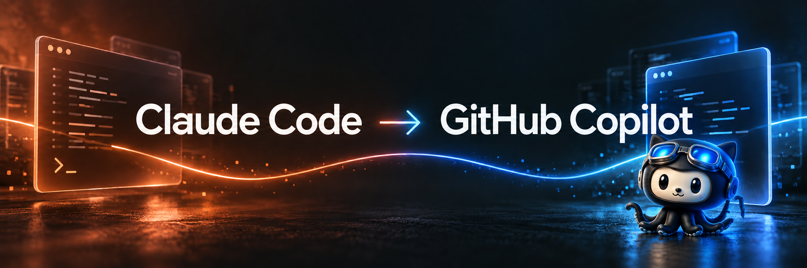

# Claude Code → GitHub Copilot

A practical transition guide for experienced Claude Code users working in **their own existing repository**. Keep the guidance and skills you already trust; learn where Copilot CLI behaves differently before approving changes. A local GitLab or GitHub checkout works for the core workflow. Copilot calls require an entitled account and network access; GitHub repository hosting is not required.

## Browse this guide

- [Get started in your repository](#get-started-in-your-repository)
- [Commands and muscle memory](#commands-and-muscle-memory)
- [Retain Claude configuration](#retain-claude-configuration)
- [Daily workflows](#daily-workflows)
- [Model choices](#model-choices)
- [Resources and troubleshooting](#resources-and-troubleshooting)
- [Source integrations](#source-integrations)

### Get started in your repository

| Resource | Description | Browse |
| --- | --- | --- |
| Existing checkout quick start | Install/login, inspect your own instructions, trace a real task, approve a scoped edit and verify with your project's checks. No sample app or Python prerequisite. | [Use Copilot in your repository](docs/start/use-copilot-in-your-repository.md) |
| Migration mindset | Separate planning, continuation, permissions and parallel workers; none substitutes for review. | [Mental model](docs/migration/mental-model.md) |

### Commands and muscle memory

| Resource | Description | Browse |
| --- | --- | --- |
| Quick translation | Familiar Claude action → Copilot CLI move and the important difference. | [CLI cheat sheet](docs/reference/cli-cheat-sheet.md) |
| Full translation | Instructions, commands, skills, sessions, review and advanced controls. | [Muscle memory](docs/reference/muscle-memory.md) |

| If you used Claude to… | In Copilot CLI… | Difference to check |
| --- | --- | --- |
| Work in an existing checkout | Run `copilot` from that checkout, inspect `/env` and `/instructions` | Verify cwd and attached guidance, not just file presence |
| Explore without editing | Start with `'--available-tools=view,grep,glob'` | This hides edit/shell tools; it is not OS isolation |
| Plan a change | Use `/plan`; review the plan before authorizing implementation | A plan is not a read-only sandbox |
| Approve an edit | Make `edit` available and keep manual `/permissions` | Review each requested write and the final diff |
| Use your existing skills | Keep `.claude/skills`; inspect `/skills` | Discovery does not guarantee that a skill was invoked |
| Continue a conversation | Use `copilot --resume` to pick the session | Check cwd, current files and grants again |
| Review work | Use `/diff`, `/review` and your own project checks | An assistant summary is not a passing test |

### Retain Claude configuration

| Resource | Description | Browse |
| --- | --- | --- |
| Compatibility by artifact | What stays, what needs an audit, and how to confirm actual attachment. | [Compatibility](docs/migration/compatibility.md) |
| Instructions and skills | Keep your repo's `CLAUDE.md`, scoped rules and skills without duplicating policy. | [Instructions](docs/customization/instructions.md) · [Skills](docs/customization/skills.md) |
| Commands and agents | Check alternate command discovery, agent tools and subagent inheritance. | [Configuration map](docs/reference/configuration-map.md) · [Agents](docs/customization/agents.md) |
| Hooks and MCP | Check payloads, server configuration and credentials before activation. | [Hooks](docs/customization/hooks.md) · [MCP](docs/customization/mcp.md) |
| Settings and plugins | Reuse the supported settings subset; inspect bundles before installing. | [Inventory](docs/migration/configuration-inventory.md) · [Plugins](docs/customization/plugins.md) |

### Daily workflows

| Resource | Description | Browse |
| --- | --- | --- |
| Planning and approvals | Scope work before execution; distinguish tool visibility, grants and isolation. | [Planning](docs/workflows/planning.md) · [Permissions](docs/workflows/permissions.md) |
| Continuation and parallel work | Bound Autopilot, assign one editor, resume with a verified handoff. | [Autopilot](docs/workflows/autopilot.md) · [Fleet](docs/workflows/fleet-and-subagents.md) · [Sessions](docs/workflows/sessions-and-context.md) |
| Finish with evidence | Inspect changes, run your own checks, report actual results. | [Review and validation](docs/workflows/review-and-validation.md) |

### Model choices

| Resource | Description | Browse |
| --- | --- | --- |
| Pinned, Auto and preview | Choose an available model deliberately; HydraFusion research preview is not Auto or fleet. | [Models and HydraFusion](docs/workflows/models-and-hydrafusion.md) |

### Resources and troubleshooting

| Resource | Description | Browse |
| --- | --- | --- |
| Troubleshoot | Missing CLI, instruction attachment, permissions, sessions and optional integrations. | [Troubleshooting](docs/reference/troubleshooting.md) · [FAQ](docs/reference/faq.md) |
| External patterns | Optional upstream skills and agents to evaluate, not install automatically. | [Curated resources](docs/reference/curated-resources.md) |

### Source integrations

| Resource | Description | Browse |
| --- | --- | --- |
| Hosting boundaries | Local Copilot use vs GitLab credentials vs GitHub cloud delegation. | [Capability boundaries](docs/hosting/capability-boundaries.md) |
| Optional automation | Host-specific MR/PR and headless flows require separate review and authorization. | [GitLab](docs/hosting/gitlab-now.md) · [GitHub-hosted capabilities](docs/hosting/github-later.md) · [Headless and CI](docs/workflows/headless-and-ci.md) |

Want a known exercise instead of your own project? [Optional practice and examples](docs/scenarios/index.md) use a separate Python lab; they are not a prerequisite. [Version and source notes](docs/reference/versions.md) distinguish documented behavior, offline checks and untested integrations.
